<div align="center">

# 🚀 Prongs | Full-Stack Developer & Blockchain Enthusiast


### 💫 *"Precision, Direction, Determination"*

[](https://github.com/ProngsDev)
[](https://github.com/ProngsDev)
[](https://github.com/ProngsDev)

</div>

---

## 🎯 About Me

```typescript
const prongs = {
    name: "Prongs",
    role: "Full-Stack Developer & Blockchain Enthusiast",
    mission: "Building innovative solutions that bridge Web2 and Web3",
    currentFocus: [
        "🤖 AI-Powered Web Applications",
        "⛓️ Smart Contract Development",
        "🎨 Modern Frontend Experiences",
        "🔒 Security-First Architecture"
    ],
    philosophy: "Code with purpose, build with passion, innovate with precision",
    lifeGoal: "Becoming a top global developer who creates meaningful impact"
};
```

### 🌟 What Drives Me
- 🎯 **Mission-Driven Development**: Every line of code serves a purpose
- ⚡ **Continuous Innovation**: Staying ahead of the technology curve
- 🛠️ **Quality Craftsmanship**: Building scalable, maintainable solutions
- 🌍 **Global Impact**: Creating technology that makes a difference

---

## 🛠️ Tech Arsenal

<div align="center">

### 🎨 Frontend Mastery
<p align="center">
  &nbsp;
  &nbsp;
  &nbsp;
  &nbsp;
  &nbsp;
  &nbsp;
  &nbsp;
  &nbsp;
  
</p>

### ⚙️ Backend Excellence
<p align="center">
  &nbsp;
  &nbsp;
  &nbsp;
  &nbsp;
  
</p>

### 🗄️ Database & Cloud
<p align="center">
  &nbsp;
  &nbsp;
  &nbsp;
  &nbsp;
  
</p>

### ⛓️ Blockchain & Web3
<p align="center">
  &nbsp;
  &nbsp;
  &nbsp;
  
</p>

### 🤖 AI & Machine Learning
<p align="center">
  &nbsp;
  &nbsp;
  &nbsp;
  
</p>

### 🛠️ Tools & DevOps
<p align="center">
  &nbsp;
  &nbsp;
  &nbsp;
  
</p>

</div>

## 🚀 Featured Projects

<div align="center">

<table>
<tr>
<td width="50%">

### 🛡️ MultiGuard
**Security-First Web Application**
- 🔒 Advanced authentication & authorization
- ⚡ Modern React frontend with responsive design
- 🔧 Robust backend architecture
- 🎯 Focus on user security and data protection

[](https://github.com/ProngsDev/multi-guard-fe)
[](https://github.com/ProngsDev/multi-guard)

</td>
<td width="50%">

### 💼 Blockchain Portfolio
**Professional Developer Showcase**
- 🌐 Modern, responsive portfolio website
- ⛓️ Blockchain development focus
- 🎨 Clean, professional design
- 📱 Mobile-first approach

[](https://github.com/ProngsDev/blockchain-portfolio)

</td>
</tr>
<tr>
<td width="50%">

### 🧠 Thinkify
**Productivity & Thinking Tool**
- 💡 Innovative approach to productivity
- 🎯 User-centric design
- ⚡ Fast and intuitive interface
- 🔄 Continuous improvement focus

[](https://github.com/ProngsDev/thinkify)

</td>
<td width="50%">

### 🏢 SaaS Landing
**Modern Landing Page**
- 🎨 Beautiful, conversion-focused design
- 📱 Fully responsive layout
- ⚡ Optimized performance
- 🚀 Ready for production

[](https://github.com/ProngsDev/SaasLanding)

</td>
</tr>
</table>

</div>

---

## 🔥 What I'm Building

```mermaid
graph LR
    A[🤖 AI Integration] --> B[🌐 Web Applications]
    B --> C[⛓️ Blockchain Solutions]
    C --> D[🔒 Security Systems]
    D --> A

    style A fill:#ff6b6b
    style B fill:#4ecdc4
    style C fill:#45b7d1
    style D fill:#96ceb4
```

<div align="center">



</div>

### 🎯 Current Focus Areas
- 🤖 **AI-Powered Applications**: Building intelligent web apps with React & FastAPI
- ⛓️ **Smart Contract Development**: Exploring innovative Web3 use cases
- 🎨 **Modern UI/UX**: Creating beautiful, accessible user experiences
- 🔒 **Security Architecture**: Implementing robust, scalable security solutions
- 📚 **Continuous Learning**: Staying ahead of emerging technologies

---

## 🌐 Connect & Collaborate

<div align="center">

### 💬 Let's Build Something Amazing Together!

[](https://github.com/ProngsDev)
[](https://linkedin.com/in/prongsdev)
[](https://twitter.com/prongsdev)
[](mailto:contact@prongsdev.com)

### 🤝 Open to:
- 💼 **Freelance Projects** - Full-stack development & blockchain solutions
- 🚀 **Collaborations** - Open source contributions & innovative projects
- 💡 **Mentoring** - Sharing knowledge with aspiring developers
- 🌟 **Opportunities** - Full-time positions in cutting-edge companies

</div>

---

<div align="center">

### 💭 Philosophy

*"Fall down seven times, stand up eight."*

**Code with Purpose • Build with Passion • Innovate with Precision**


</div>
